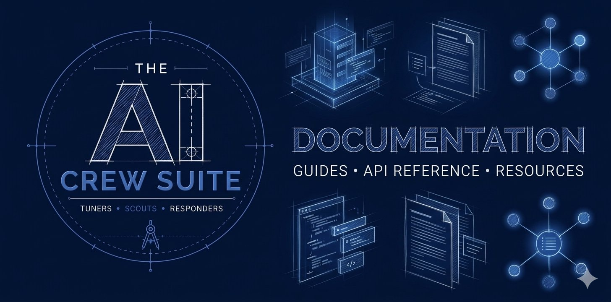

# AI Crew Suite Documentation



AI Crew Suite is a Backstage plugin workspace for building retrieval-augmented, tool-using AI agents inside a developer portal. It began as a fork of the Roadie RAG AI plugins, but the architecture has been reshaped from a single assistant that answers one retrieval-backed question into a core platform for agents, crews, provider modules, runtime persistence, and structured execution streams.

This repo provides the documentation and marketing site for the project: user reference, how-tos and guides, and blog articles.

## 🏗️ Development Workflow

**Prerequisites:**

- Node.js `>=22.22.2`
- Yarn `4.17.1`, as declared by `packageManager`

### 1. Installation & Builds

Run installation routines:

```bash
# optional refresh flag forces full install if wanted
yarn install --refresh
yarn build
```

### 2. Running Unit & Integration Tests

```bash
yarn lint
yarn test:unit
```

## 🚀 Release & Publication Management

Publish a new version:

```bash
yarn publish
```

## 🔊 Get involved

### Issues and Discussions

Please open a [Discussion](https://github.com/ai-crew-suite/documentation/discussions) to get help, suggest a new feature, or to report a bug. We only want maintainers to open Issues.

- [GitHub Discussions for AI Crew Suite Infra](https://github.com/ai-crew-suite/documentation/discussions)

### Contributing

To contribute to AI Crew Suite, please read the contributing guidelines.

- [Guidelines for Contributing](https://github.com/ai-crew-suite/documentation/blob/main/.github/CONTRIBUTING.md)

### Contact and Social Media

The AI Crew Suite project is proudly supported and actively maintained by Webstack Builders.

- Contact [Webstack Builders](https://webstackbuilders/contact/) for commercial support questions.

Follow us on:

- BlueSky: [social@ai-crew-suite.dev](https://ai-crew-suite.bsky.social)
- LinkedIn: [linkedin.com/company/ai-crew-suite](https://linkedin.com/company/ai-crew-suite)

## 🛡️ Security / Disclosure

If you find any bug with AI Crew Suite that may be a security problem, please report it through the [GitHub Security Advisories process](https://github.com/ai-crew-suite/documentation/security/advisories). This way we can evaluate the bug and hopefully fix it before it gets abused. Please give us enough time to investigate the bug before you report it anywhere else.

If you would like to discuss a potential finding before raising the Advisory, then e-mail us at [security@ai-crew-suite.dev](mailto:security@ai-crew-suite.dev).

## ©️ Compliance and Licensing

Copyright © 2026 The AI Crew Suite Authors.
Licensed under the **Apache License, Version 2.0**.
